# clio-tools — Beroendegraf

Genererad: 2026-04-10
Verktyg: Steg 1 i ADD clio-install

---

## Mermaid-graf

```mermaid
graph TD
  %% ── Entry point ──────────────────────────────────────────────
  clio_py["clio.py (nav/entry point)"]

  %% ── clio-core (bas för allt) ─────────────────────────────────
  clio_core["clio-core 📦"]

  %% ── Moduler ──────────────────────────────────────────────────
  mail["clio-agent-mail"]
  obit["clio-agent-obit"]
  docs["clio-docs"]
  email["clio-emailfetch"]
  fetch["clio-fetch"]
  lib["clio-library"]
  narrate["clio-narrate"]
  partnerdb["clio-partnerdb"]
  ps["clio-powershell ⚠️"]
  privfin["clio-privfin ⚠️"]
  research["clio-research"]
  transcribe["clio-transcribe"]
  vision["clio-vision"]

  %% ── Systemprogram ────────────────────────────────────────────
  python["Python 3.x 🛠"]
  git["Git 🛠"]
  exiftool["exiftool 🛠"]
  ollama["Ollama 🛠"]
  digikam["DigiKam 🛠 (valfri)"]
  tesseract["Tesseract 🛠"]
  pwsh["PowerShell 🛠"]

  %% ── pip-paket (A) ────────────────────────────────────────────
  anthropic["anthropic pip"]
  dotenv["python-dotenv pip"]
  notion["notion-client pip"]
  thefuzz["thefuzz pip"]
  levenshtein["python-Levenshtein pip"]
  openpyxl["openpyxl pip"]
  ocrmypdf["ocrmypdf pip"]
  pypdf["pypdf pip"]
  pymupdf["pymupdf/fitz pip"]
  pillow["Pillow pip"]
  pytesseract["pytesseract pip"]
  pyexiftool["pyexiftool pip"]
  whisper["faster-whisper pip"]
  edgetss["edge-tts pip"]
  mutagen["mutagen pip"]
  docx["python-docx pip"]
  requests["requests pip"]
  bs4["beautifulsoup4 pip"]
  lxml["lxml pip"]
  chardet["chardet pip"]
  send2trash["send2trash pip"]
  keyring["keyring pip"]
  pyyaml["pyyaml pip"]
  gedcom["python-gedcom pip"]

  %% ── PATH & env (D) ──────────────────────────────────────────
  env_key["ANTHROPIC_API_KEY 🔑"]
  env_smtp["SMTP_PASSWORD 🔑"]
  path_exiftool["PATH: exiftool"]
  path_ollama["PATH: ollama"]

  %% ── Kopplingar: entry point → moduler ───────────────────────
  clio_py --> mail
  clio_py --> obit
  clio_py --> docs
  clio_py --> email
  clio_py --> fetch
  clio_py --> lib
  clio_py --> narrate
  clio_py --> partnerdb
  clio_py --> ps
  clio_py --> privfin
  clio_py --> research
  clio_py --> transcribe
  clio_py --> vision

  %% ── clio-core (B) ────────────────────────────────────────────
  mail --> clio_core
  obit --> clio_core
  email --> clio_core
  fetch --> clio_core
  lib --> clio_core
  narrate --> clio_core
  research --> clio_core
  transcribe --> clio_core
  vision --> clio_core

  %% ── pip per modul (A) ────────────────────────────────────────
  mail --> anthropic
  mail --> dotenv
  mail --> notion

  obit --> pyyaml
  obit --> requests
  obit --> bs4
  obit --> dotenv
  obit --> gedcom

  docs --> ocrmypdf
  docs --> pypdf
  docs --> pymupdf
  docs --> pillow
  docs --> pytesseract

  email --> keyring
  email --> dotenv
  email --> anthropic

  fetch --> requests
  fetch --> bs4
  fetch --> lxml
  fetch --> chardet
  fetch --> send2trash
  fetch --> anthropic
  fetch --> dotenv

  lib --> notion
  lib --> thefuzz
  lib --> levenshtein
  lib --> openpyxl
  lib --> anthropic
  lib --> dotenv

  narrate --> edgetss
  narrate --> mutagen
  narrate --> docx
  narrate --> anthropic
  narrate --> dotenv

  partnerdb --> gedcom

  research --> notion
  research --> anthropic
  research --> dotenv

  transcribe --> whisper
  transcribe --> anthropic
  transcribe --> dotenv

  vision --> pyexiftool
  vision --> pillow
  vision --> pytesseract
  vision --> anthropic
  vision --> dotenv

  %% ── Systemprogram (C) ────────────────────────────────────────
  vision --> exiftool
  vision --> ollama
  vision --> digikam
  docs --> tesseract
  vision --> tesseract
  ps --> pwsh

  %% ── PATH & env (D) ──────────────────────────────────────────
  exiftool --> path_exiftool
  ollama --> path_ollama
  vision --> env_key
  mail --> env_key
  fetch --> env_key
  lib --> env_key
  narrate --> env_key
  research --> env_key
  transcribe --> env_key
  email --> env_key
  obit --> env_smtp

  %% ── Bas: Python + Git ────────────────────────────────────────
  clio_core --> python
  clio_py --> python
  clio_py --> git
```



---

## Beroendelista per kategori

### A — pip-paket

| Paket | Version | Används av |
|---|---|---|
| anthropic | >=0.25.0 | mail, email, fetch, lib, narrate, research, transcribe, vision |
| python-dotenv | >=1.0.0 | mail, obit, email, fetch, lib, narrate, research, transcribe, vision |
| notion-client | >=2.0.0 | mail, lib, research |
| thefuzz | >=0.19.0 | lib |
| python-Levenshtein | >=0.12.0 | lib, obit (valfri) |
| openpyxl | >=3.1.0 | lib |
| ocrmypdf | >=16.0.0 | docs |
| pypdf | >=4.0.0 | docs |
| pymupdf | >=1.23.0 | docs (importeras som fitz) |
| Pillow | >=10.0.0 | docs, vision |
| pytesseract | >=0.3.10 | docs, vision |
| pyexiftool | >=0.5.0 | vision |
| faster-whisper | >=1.0.0 | transcribe |
| edge-tts | >=6.0.0 | narrate |
| mutagen | >=1.45.0 | narrate |
| python-docx | >=0.8.11 | narrate |
| requests | — | fetch, obit |
| beautifulsoup4 | — | fetch, obit |
| lxml | — | fetch |
| chardet | — | fetch |
| send2trash | — | fetch |
| keyring | — | emailfetch |
| pyyaml | — | obit |
| python-gedcom | — | obit, partnerdb |

### B — clio-core

| Komponent | Detektering | Installationsvektor |
|---|---|---|
| clio_core | `importlib.util.find_spec("clio_core")` | `pip install -e ./clio-core` |

### C — Systemprogram

| Program | Detektering | winget-kommando | Manuell URL | Blockande? |
|---|---|---|---|---|
| Python 3.x | `where python` / `sys.version` | `winget install Python.Python.3` | python.org | ✅ Ja |
| Git | `where git` | `winget install Git.Git` | git-scm.com | ✅ Ja |
| exiftool | `where exiftool` ELLER `clio-vision/exiftool-13.54_64/` | Ingen winget | exiftool.org | Nej (clio-vision) |
| Ollama | `where ollama` | `winget install Ollama.Ollama` | ollama.com | Nej (clio-vision) |
| DigiKam | `where digikam` ELLER registry | `winget install KDE.digiKam` | digikam.org | Nej (valfri) |
| Tesseract | `where tesseract` | `winget install UB-Mannheim.TesseractOCR` | github.com/UB-Mannheim | Nej (docs/vision) |
| PowerShell | `where pwsh` / `where powershell` | inbyggt i Windows 10 | — | Nej (clio-powershell) |

### D — PATH & miljövariabler

| Post | Detektering | Åtgärd |
|---|---|---|
| ANTHROPIC_API_KEY | `os.environ.get("ANTHROPIC_API_KEY")` | Skapa `.env`-stub om `.env` saknas |
| SMTP_PASSWORD | `os.environ.get("SMTP_PASSWORD")` | Visas som instruktion (clio-agent-obit) |
| PATH: exiftool | `shutil.which("exiftool")` | `setx PATH` (user) om lokal kopia finns |
| PATH: ollama | `shutil.which("ollama")` | `setx PATH` (user) efter winget-install |

---

## Röda flaggor

| # | Flagga | Konsekvens |
|---|---|---|
| 1 | `clio-core` saknar `check_deps.py` | Installern kan inte verifiera clio-core via befintligt mönster — installern måste detektera direkt med `importlib.util.find_spec("clio_core")` |
| 2 | `clio-powershell` saknar `check_deps.py` + `requirements.txt` | Oklar status — installern markerar som **SKIP** och rapporterar |
| 3 | `clio-privfin` saknar `check_deps.py` + `requirements.txt` | Samma — markeras **SKIP** |
| 4 | `clio-partnerdb` saknar `requirements.txt` | Beroenden (python-gedcom) hanteras bara i check_deps.py |
| 5 | 10 moduler saknar `README.md` | Flaggas i Steg 2, åtgärdas separat |
| 6 | **Hårdkodad sökväg** i `clio-library/build_library_excel.py:433` → `/home/claude/...` | Måste fixas före GitHub-push |
| 7 | Tesseract saknas i ADD:ns systemprogramstabell | ADD täcker bara exiftool/Ollama/DigiKam/Git/Python — Tesseract måste läggas till |

---

## Föreslagen installationsordning

```
1. Python 3.x          [blockande — allt annat kräver Python]
2. Git                 [blockande — repo-hantering]
3. clio-core           [blockande — B-beroende för 9 moduler]
4. pip-paket (A)       [per modul, parallellt möjligt]
5. exiftool PATH       [om lokal kopia finns i clio-vision/]
6. Tesseract           [behövs av docs + vision]
7. Ollama              [behövs av clio-vision, tung download]
8. DigiKam             [valfri, clio-vision/digikam-browser]
9. .env-stub           [ANTHROPIC_API_KEY]
10. PATH-verifiering   [bekräfta att allt är åtkomligt]
```
